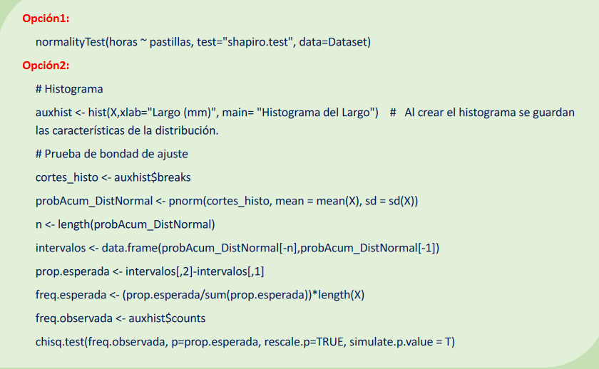
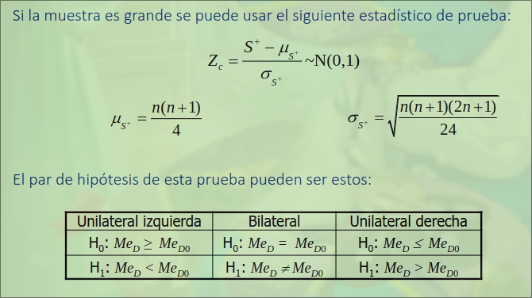
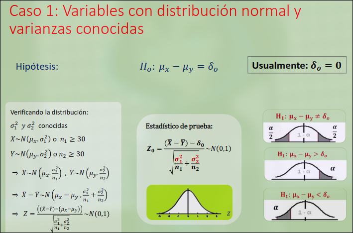
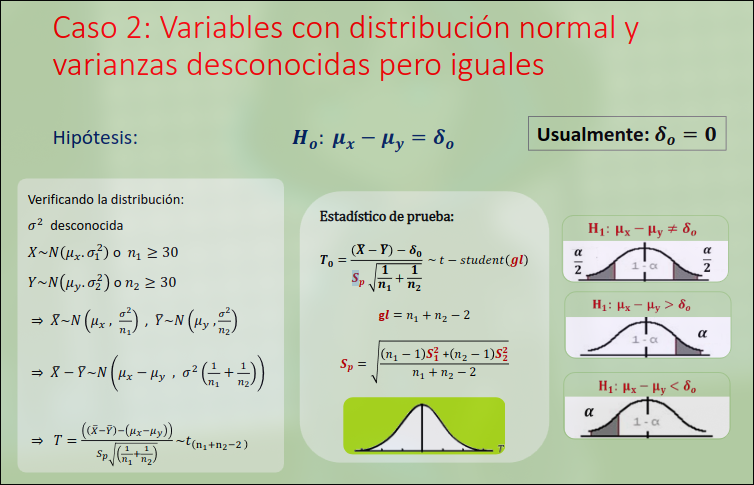
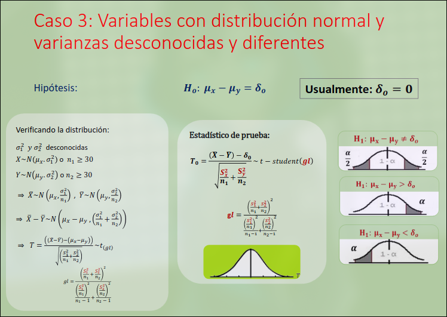
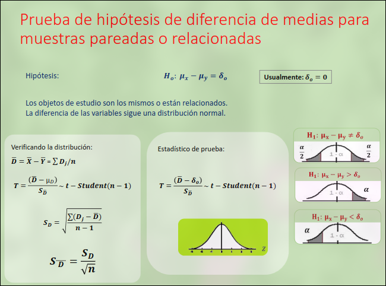
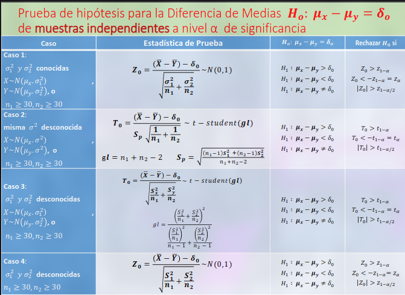
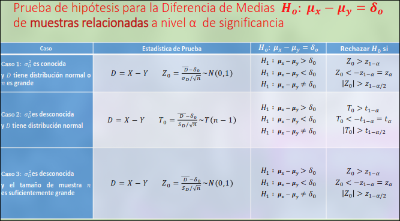
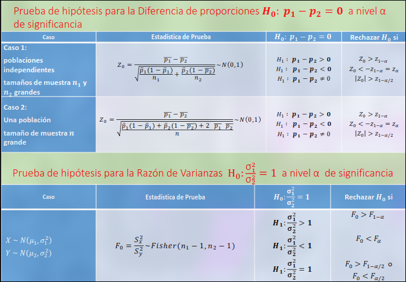

# Librerias

```R
library(DescTools)
library(ggplot2)
library(MASS)
```

# Lectura de archivos

```R
# Para leer archivos xlsx
data <- read_xlsx(path="directory/file.xlsx")
head(data)
# Para leer archivos csv
data <- read.csv("directory/file.csv")
```

# Pruebas de bondad de ajuste

## Distribución multinominal

- Repetir n veces, de forma independiente
- $k(k \geqslant 2)$ resultados o categorias
- $C_1, C_2, \dots, C_k$ con $p_1,p_2,\dots,p_k$
- $\sum_{i = 1}^{k}p_i = 1$
- Notación: $(X_1,X_2,\dots,X_k)\sim Mult(n,p_1,p_2,\dots,p_k)$

### Función de probabilidad conjunta

Si $(X_1,X_2,\dots,X_k)\sim Mult(n,p_1,p_2,\dots,p_k)$

$$
P(X_1=x_1,\dots,X_k=x_k) = \frac{n!}{x_1!\dots x_k!} p_{1}^{x_1}\dots p_{k}^{x_k}
$$
- $X_1,X_2,\dots,X_k$ **NO** son independientes
- $X_1 \sim B(n,p_i), \forall i = 1, \dots,k$
- $E(X_i) = np_i$
- $V(X_i) = np_i(1 - p_i)$
- $Cov(X_i,X_j) = -np_ip_j,\text(si)\ i\neq j$


## Pruebas Chi-cuadrado

Utilizado para contrastar hipótesis acerca de los parámetros, de 1 o varias distribuciones multinominales.

$$
W=\sum_{i = 1}^{k}\frac{(X_i - E_i)^2}{E_i}
$$

### Teorema 1

Si **n** es grande, $\forall i = 1,\dots,k$ se cumple que $E_i = np_i \geqslant 5$

$$
W=\sum_{i = 1}^{k}\frac{(X_i - E_i)^2}{E_i} = \sum_{i = 1}^{k}\frac{(X_i - np_i)^2}{np_i}
$$

Tiene distribución Chi-cuadrado con (K - 1) grados de libertad $W \sim X_{(k - 1)}^2$


## Prueba Chi-cuadrado para bondad de ajuste

Es la prueba para determinar si la variable que observamos se ajusta o no a una distribución teórica.

$$
\begin{cases}
H_0 :& F_Y = F_o\\
H_1 :& F_Y \neq F_o
\end{cases}
$$

Experimento multinominal de *k* categorías excluyentes.

- $C_1,\dots,C_k$ con probablidades $p_1,\dots,p_k$

- Frecuencias observadas $x_1,\dots,x_2$, donde $\sum_{i=1}^{k}x_i = n$

- $X_i$ números de veces en que ocurre la categoría $C_i$

- Contrastar si las frecuencias observadas de cada categoría difieren significativamente, de las frecuencias esperadas $e_i = np_i$

$$
\begin{cases}
H_0:& \forall i: p_i = p_i^o\\
H_1:& \exists i | p_i \neq p_i^o
\end{cases}
$$

Si $e_i = np_i^0 \geqslant 5$, la estadística de prueba:

$$
W=\sum_{i=1}^{k} \frac{(X_i - np_i^0)^2}{np_i^0} = \sum_{i=1}^{k} \frac{(O_i - e_i^0)^2}{ei}
$$

Punto crítico, se distribuye Chi-cuadrado con $k-1$ grados de libertad: $W\sim X_{k-1}^2$.


# Pasos para la prueba de Chi-cuadrado(x^2) de bondad de ajuste

1. Establecer las hipótesis sobre la función de distribución desconocida

$$
\begin{cases}
H_0 &: F_Y = F_0 \\
H_1 &: F_Y \neq F_0
\end{cases}, con\ F_0\ conocida
$$


2. Obtener una tabla aleatoria de tamaño **n** de *Y*, con una tabla de distribución de frecuencias.

```
| Intervalos | marca de clase | frecuencia observada | frecuencia esperada |
```


3. Se calculan las frecuencias esperadas $E_i^0$

4. Se calcula Estadístico de prueba

$$
U_0 = \sum_{i = 1}^{k}\frac{(O_i - E_i^0)^2}{E_i^0} \sim X_(k -m-1)^2
$$

5. Se recha si $U_0 > X_{1-\alpha,k-m-1}^{2}$, donde $r$ es la cantidad de parametros desconocidos.


## Comandos utilices en R




# Pruebas no paramétricas

Los investigadores están más familiarizados con las pruebas paramétricas, estas tienen supuestos usualmente acerca del tipo de variables y la distribución de la variable, los cuales tiene que ser verificados y en caso no cumplas los supuestos, utilizar pruebas no paramétricas.


## Prueba Wilcoxon

### Utilidad

Evaluación de la medida de posición de una muestra.

No se requiere de ningún supuesto acerca de la forma de la distribución de la población.


- $H_0: Me = Me_0$

### Procedimiento

Diferencia entre cada valor observado y el valor hipotético de la mediana.

$$
d = (X - med_0)
$$
Calculamos al diferencia sin tomar el signo de las mismas.

En caso de empate, se asigna un rango promedio de todas las diferencias empatadas.


La suma de rangos positivos $S^+$ es el estadístico de prueba, el cual es comparado con un valor de la talba de Wilcoxon

Forma práctica, se enumar de menor a mayor diferencia, y posteriormente se verifica en cuantos se encuentra empate en la diferencia para posteriormente realizar el promedio de las diferencias de dichos valores

## Otros estadísticos de prueba



## En R

```
wilcox.test(data, mu = , alternative = "greater",conf.level = 1 - alpha, correct = F)
```

# Prueba de Hipótesis para 2 parámetros

## Diferencia de Medias

- Contrastar la diferencia de 2 medias $H_0:\mu_x - \mu_y = \delta_o$
- Puede ser tanto muestras independientes o muestras relacionadas.

### Para parámetros de muestras independientes

Hipótesis:

$$
\begin{cases}
H_0 &: \sigma_x^2 / \sigma_y^2 = 1 \\
H_1 &: \sigma_x^2 / \sigma_y^2 \neq 1
\end{cases}
$$

1. Verificando la distribución, si:

$$
X\sim N(\mu_1,\sigma_1^2)\ y \ Y \sim N(\mu_2,\sigma_2^2)\\
\Rightarrow F = \frac{S_x^2}{S_y^2}\sim Fisher(n_1 -1, n_2 - 1)
$$

Donde $n1$ y $n2$ son el tamañao de la muestra para $X$ y $Y$ respectivamente.

Para hallar la fisher es con el siguiente comando:

```R
alpha = 0.05
qf(alpha/2,n1 - 1,n2 - 1)
qf(1-alpha/2,n1 - 1 ,n2 -1)
```

<br>

#### Varianzas conocidas

Espacio




```R
z0 = ((medianX - mediamY) - delta0)  / (sqrt())
```
<br>

#### Varianzas desconocidas e iguales

espacio




```R
n1 = 5
n2 = 5
s1 = 0.1811
s2 = 0.067
media1 = 0.417
media2 = 0.151
sp = sqrt(((n1 - 1)*(s1^2) + (n2 - 1)*(s2^2))   /   (n1 + n2 - 2) )
to = (media1 - media2) / (sp * sqrt(1/n1 + 1/n2))

qt(alpha,n1 + n2 - 2)

# to > qt rechazamos H0
```

#### Varianzas desconocidas y diferentes

Espacio




```R
gl = (S1/n1 + S2/n2) / ( ((s1/n1)^2)/(n1 - 1) +  ((s2/n2)^2)/(n2 - 1) )
qt(1-alpha, n1 + n2 - 2)
```

## Prueba de hipótesis para la diferencia de medias de muestras relacionadas










### Prueba de hipótesis NO paramétricas para 2 o más parámetros

#### Prueba de U de Mann Whitney

- Es considerada como la alternativa no paramétrica a una prueba de diferencias de medias.
- Se basa en los rangos observados
- Permite comparar las **medianas** de dos muestras independientes son diferentes.


